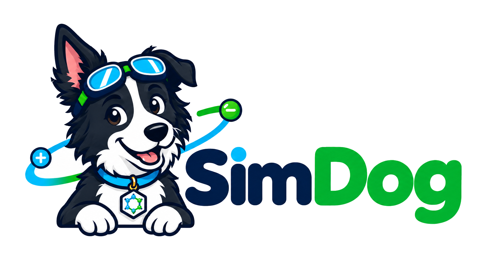
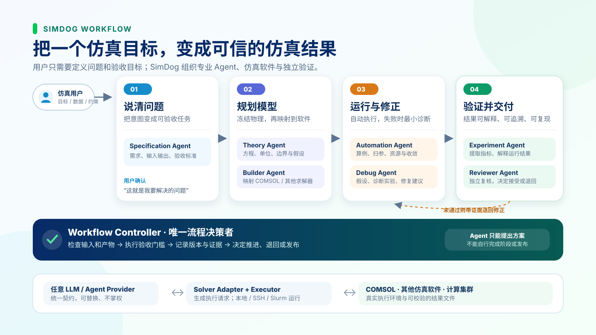

<p align="center">
  
</p>

<p align="center">
  <strong>面向论文复现、仿真自动化、模型 Debug 与模型搭建的多智能体仿真工程平台</strong>
</p>

<p align="center">
  
</p>

SimDog 将可替换的 LLM/Agent 与确定性的工作流、求解器执行和科学验收分离。Agent 负责提出方案；只有 Workflow Controller 可以推进状态、验收产物与发布结果。

## 安装

SimDog 需要 Python 3.10 或更高版本。

```bash
git clone https://github.com/aoyang17/SimDog.git
cd SimDog
python3 -m venv .venv
source .venv/bin/activate
python3 -m pip install -e .
```

验证安装：

```bash
simdog --help
simdog adapters
python3 -m unittest discover -s tests -v
```

## 最小使用

创建一个受 Controller 管理的仿真工作区：

```bash
simdog init \
  --root /path/to/my-simulation \
  --template templates/workflows/debug.yml \
  --title "My simulation"

simdog status --root /path/to/my-simulation
```

查看 COMSOL 执行计划，不启动求解器：

```bash
simdog plan-adapter \
  --adapter comsol \
  --spec examples/distributed_ecm/comsol_plan.yml
```

远程运行需要用户自己的 SSH 配置与外部密钥引用。连接配置放在 `config/local/connections/`，运行数据放在 `workspaces/`；两者默认不进入 Git。

## 仿真软件对接

| 仿真软件或接口 | 第一版状态 | 能力 |
|---|---|---|
| COMSOL Multiphysics | 已对接并完成真实验证 | Java 编译、MPH batch、SSH/Slurm 运行、产物校验 |
| 通用命令行求解器 | 已支持 | 通过参数数组运行已有求解器、脚本或验证器 |
| OpenFOAM | 规划中 | 通过独立 Solver Adapter 扩展 |
| Abaqus | 规划中 | 通过独立 Solver Adapter 扩展 |
| 其他商业或开源求解器 | 可扩展 | 使用 `simdog.solver_adapters` Python entry point 注册 |

首个真实 qualification 使用 COMSOL 6.4 完成 DistributedECM 算例。设计与安全边界见 [架构说明](docs/architecture.md) 和 [安全说明](docs/security.md)。
